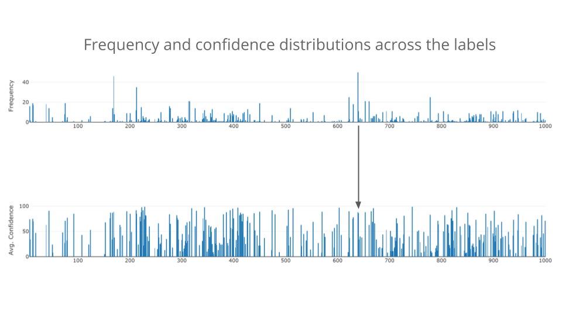

# MLwatch: Keep an eye on your predictions.  

MLwatch is a pipeline to serve and monitor a machine learning (ML) model in a scalable way.

## Motivation
Being able to serve online ML predictions at scale is important in many use cases such as autonomous vehicles, anomaly detection, estimated time of arrival predictions, etc. 
Furthermore, unpredictable shifts in live data is a common concern for many production ML models once they are deployed. 
The ML model developers may not always have the metrics ready to help them decide when to retrain their models. 
As a result, they retrain the models at frequencies which may be more or less than actually needed. 
MLwatch aims to produce near realtime statistics on the predictions of the model to help ML model developers monitor fitness of the model to shifts in the incoming data.

## The DE challenges

The main data engineering challenge in this system is to integrate the ML component to the datapipleline so that a high-number of inferences can be made (e.g. 1000 inferences/sec.) with a relatively small time delay (<1 min). 
While a sub-minute delay is not necessary for monitoring the performance metrics, it would be useful in case an anomaly-detection mechanism would be tied to this pipeline. 

## The pipeline


* Data: Images from the test set of ImageNet Object Recognition Challenge dataset on Kaggle.
* Resources: 4 AWS m4.large nodes (2 vCPUs and 8GB memory each), 1 serving as a master node and 3 serving as Spark workers with 3x oversubscription (`SPARK_WORKER_CORES=6`).  
* Ingestion: A Kafka producer writing filesystem paths of the images to a single topic at a controllable rate.
* Processing: Tensorflow instances using Inception V3 pretrained model, created and managed by Spark Streaming. 
* Database: Cassandra to store prediction frequency and cumulative confidence for each label.
I chose Cassandra because I knew the queries I needed and I wanted take advantage of high write speed and relatively easy scalability of Cassandra. 
* User Interface: Dash to display the frequency and confidence levels over the set of 1,000 labels based on the all the predictions to date.
For example, the following pair of plots show the frequency and average confidence of each ImageNet label that has been predicted thus far, and they get updated periodically  (e. g. once a minute).
If a particular label turns out to be served very frequently and its confidence level is below a certain treshol then this could be an indication that the ML model needs to be retrained regarding that label. 


## Tackling the challenges (one bottleneck at a time)

Due to the priorities of the project, my approach to this problem was to first build the pipeline end-to-end then optimize the bottlenecks to impove throughput. 
As such, I iterated several times to remove a series of bottlenecks after completion of an initial pipeline.
In my first iteration, I used to pass URLs of the images from a text file to multiple Tensorflow instances through Kafka.
While I was able to get some data moving thorough the pipeline, fetching data from the URLs would cause a lot of delay due to slow/missing/bad data.

In my second iteration, I downloaded a subset of ImageNet images (.jpeg files of ~200KB each) and passed them through the Kafka producer.
As I anticipated, the serialization/deserialization overhead between Kafka and Spark became the new bottleneck.

I quickly moved on to the third iteration, in which I passed the paths instead of the actual images from Kafka to Spark.
Each Tensorflow instance would then read the images directly from the filesystem.
This modification made the Tensorflow inference the new bottleneck, with a rate of 2-3 inferences per second and the Spark job dying after a few hundred inferences.
The reason for the slow response and unstable behavior was due to a naive way of mapping the inferencerequests to expensive processes, as follows:
```
paths.map(lambda x: tflow.infer(x, broadcast_data))
```
where `tflow.py` looks like

```
# Several import statements here.
def infer(path, broadcast_data)
    # Complex graph instantiations and computations here
    return prediction
```
This method would map each record separately to each worker which would create and destroy a Tensorflow instance upon every single inference request, which causes a large amount of overhead per inference.

In my fourth iteration I researched how the Tensorflow instances can be saved and reused for a series of requests.
I found out that I could map an entire partition of records to each worker by using `.mapPartitions` method instead of `.map`:

```
paths.mapPartitions(lambda x: tflow.infer(x, broadcast_data))
```
and convert my Tensorflow function to a generator using the `yield` statement instead of `return`:

```
# Several import statements here.
def infer(path, broadcast_data)
    # Complex graph instantiations and computations here
    yield prediction
```

This modification massively increased the inference rate to ~150 inferences/sec. (or ~50 inferences/sec. per node).
I was able to repartition each batch as high as `.repartition(108)` and process 15-second batches of over 2,000 records each just under 15 seconds.
This iteration was the most challenging and rewarding improvement I have done on this pipeline thus far.
This iteration was also where I had to stop working on the project and concentrate on the rest of the interview preparations.

The current bottleneck is the `.reduceByKey` operation, which presumably suffers from a very little memory left after all the Tensorflow instances deployed.
I have also observed that Cassandra service would go down in any one of the worker nodes during the process. 
I played around with related Spark configuration settings related to memory allocations to leave some room for the rest of the operations. 
However, I could not make the rest of the pipeline to keep up with the high-rate of inferences completed; I was able sustain only about 15 inferences/sec. across the whole pipeline down to Cassandra. 
I presume keeping up with the 150 inferences/second might require a more careful allocation of resources within each node or perhaps scaling up each node (e. g. m4.xlarge) to make room for the rest of the operations in the pipeline.

