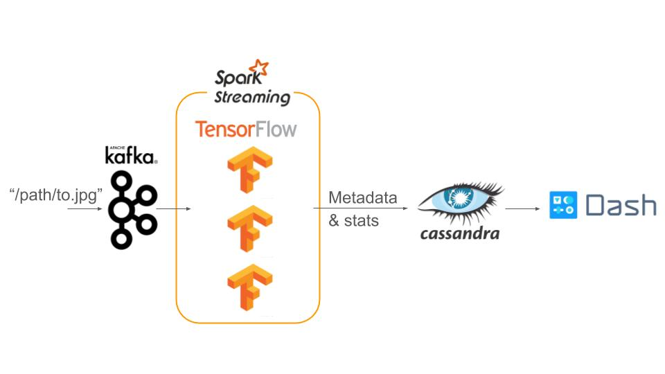

# MLwatch: Keep an eye on your predictions.  

## What?
MLwatch is a pipeline to enable continuous service and monitoring of machine learning models.

## Why?
Online, responsive ML prediction is important in many use cases such as UAV operations, ETA predictions, anomaly detection, etc. However, unpredictable shifts in live data is a common concern for many production ML models. The ML model developers may not always have the metrics ready to help them decide when to retrain their models. As a result, they retrain the models at frequencies which may be more or less than actually needed. In additon, once they decide to retrain, they may not be able to incorporate new training data in their models. MLwatch aims to monitor the statistics of the predictions to help ML model developers monitor the response of their model to changes in the incoming data.

## Specifications:
* Online prediction response time: <5 sec.
* Online prediction rate         : O(1,000) per sec.
* Top-1 accuracy                 : >75%
* Batch processing mode          : Run when average Top-1 accuracy <90%

## Challenges

The primary data engineering challenge for this system is high-availability and near-realtime response to a high-rate of prediction requests. The other data engineering challenge is deciding when to retrain the model and executing retraining in batch mode. 

## How?

* Data: URL's to Image-Net (14M images), Open Image dataset (9M images), or generally some labeled dataset with a pretrained model. 
* Ingestion: Kafka producers fetching URL's. For demo, the URL are read-off a text file.
* ML Model: The pretrained model of the data set. (Inception, Resnet, VGG, ...) encapsulated in multiple Kafka consumers in ca consumer group

